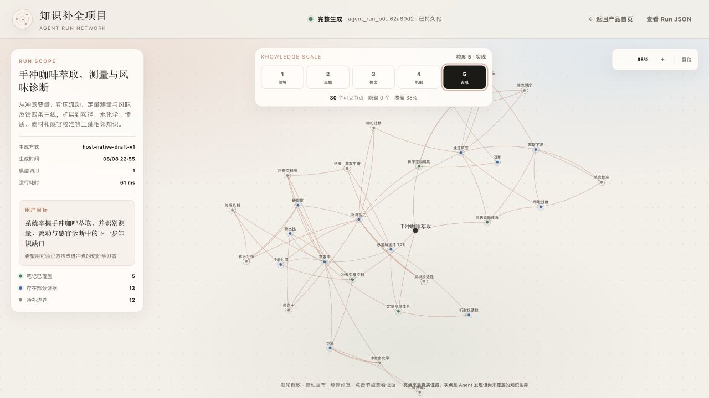
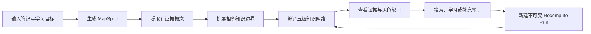
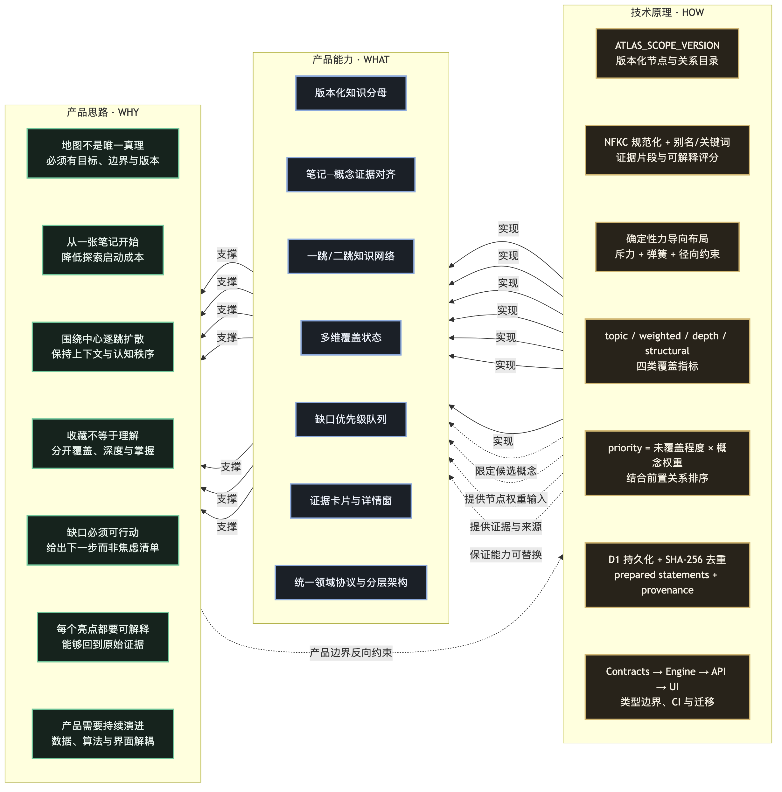
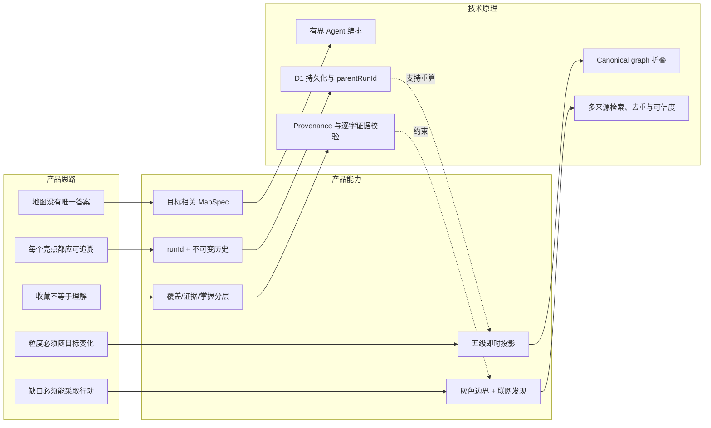
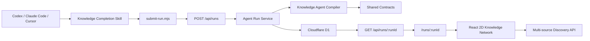

# 知识补全 · Knowledge Completion

> 从一篇笔记出发，由 AI 生成目标相关、证据可追溯、可切换粒度的知识网络；每次调用都有唯一 `runId`、持久化图谱和可直接打开的交互页面。

<p align="center">
  <a href="https://github.com/noxinsun-source/knowledge-completion/actions/workflows/ci.yml"></a>
  
  
  
</p>

> 想快速上手？请先阅读 **[快速上手与本地运行指南](QUICKSTART.md)**，其中包含源码获取、8 分钟跑通、密集图谱复现与验证清单。



<p align="center"><sub>真实持久化三跳 Run：Plugin / Skill 提交笔记与宿主 AI 草稿后生成唯一 runId，页面从 D1 回读 30 个节点、65 条关系和五级投影；亮点表示逐字可核验的笔记证据，灰点表示尚未覆盖的相邻知识。</sub></p>

<p align="center"><b>四段真实录屏（点击任意一张可放大）：</b></p>

<table>
  <tr>
    <td align="center" width="50%"><a href="public/demo/input.gif"></a><br><sub>① 首页输入任意笔记 + 选颗粒度/跳数，实时显示「真实模型已接入」</sub></td>
    <td align="center" width="50%"><a href="public/demo/hierarchy.gif"></a><br><sub>② 五级知识粒度切换：1 领域 → 3 概念 → 5 公式实现，层级即时折叠/展开</sub></td>
  </tr>
  <tr>
    <td align="center" width="50%"><a href="public/demo/evidence.gif"></a><br><sub>③ 点击节点查看逐字可核验的笔记证据</sub></td>
    <td align="center" width="50%"><a href="public/demo/search.gif"></a><br><sub>④ 节点联网搜索 → 右侧返回 Crossref / Europe PMC / arXiv / Wikipedia 真实结果</sub></td>
  </tr>
</table>

<p align="center"><sub>以上四段均为真实录屏，由 DeepSeek `deepseek-chat`（`provider: openai-compatible:deepseek-chat`）真实生成知识网络。完整串联流程见 <a href="public/demo.gif">完整演示动图</a>。</sub></p>

知识补全不是一张预先写死的“标准答案知识树”。它把地图定义成：**在某个用户目标、受众、粒度、扩展跳数、节点预算和证据阈值下，对当前输入笔记所做的一次可审计建模**。

本仓库同时提供：

- 可执行的开放领域知识图谱 Agent；
- 持久化 Agent Run API；
- 以 `runId` 为入口的动态 2D 知识网络；
- 可安装的 Codex Plugin；
- Claude Code、Cursor 和通用 Agent Skill 适配；
- 一个无需模型密钥即可跑通的离线模式，以及由宿主 AI 生成相邻知识草稿的模式。

> [!IMPORTANT]
> 当前版本适合**本地单用户使用、产品验证和二次开发**。Run API 会保存完整笔记正文，但尚未提供登录、租户隔离和公网限流；请不要把它未经安全加固直接暴露到公网。

## 1. 五分钟跑通

### 1.1 准备环境

- macOS、Linux 或 Windows；
- Node.js `>= 22.13.0`；
- npm；
- Git；
- 一个现代浏览器。

### 1.2 启动完整产品

```bash
git clone https://github.com/noxinsun-source/knowledge-completion.git
cd knowledge-completion
npm install
npm run dev
```

产品地址：<http://localhost:4318>

不要直接双击 HTML 文件。产品包含 API、D1 持久化和动态路由，必须由 `npm run dev` 或正式部署运行。

**网页端直接创建 Run（无需 CLI）**：打开首页 <http://localhost:4318>，在顶部表单粘贴任意笔记/话题，选择「知识颗粒度（1 领域 → 5 公式实现）」与「扩散跳数（1–3）」，点击「生成知识网络」即可。配置了模型后走真实 LLM 多跳扩散；未配置则用离线提取。首页会实时显示「真实模型已接入」或「离线提取模式」。

### 1.2.1 让 Run API 调用真实模型（可选，已实测）

默认不配置密钥时，`POST /api/runs` 使用 `heuristic-offline-v1` 离线提取（只承认笔记内证据，绝不伪装知道笔记外知识）。要让 Run API 本身调用真实 OpenAI-compatible 模型做有界语义扩展，只需在启动前导出三个环境变量：

```bash
export KNOWLEDGE_AGENT_BASE_URL=https://api.deepseek.com   # 或 https://api.openai.com/v1、硅基流动等
export KNOWLEDGE_AGENT_MODEL=deepseek-chat                  # 或 gpt-4.1、Qwen/Qwen3-8B 等
export KNOWLEDGE_AGENT_API_KEY=sk-你的密钥
npm run dev
```

之后用浏览器或 helper 创建 Run 时，响应里的 `provider` 会变成 `openai-compatible:<model>`，图谱会包含真实模型提出的相邻知识（无笔记证据的节点自动保持灰色边界）。这三个变量同样驱动 `npm run agent` 的 CLI 模型模式，与 Run API 共享同一套 provider 实现。

`KNOWLEDGE_AGENT_BASE_URL` 接受任意 OpenAI-compatible 端点，覆盖以下常见适配场景（模型名按各自服务填写）：

| 场景 | `KNOWLEDGE_AGENT_BASE_URL` | 模型示例 | 说明 |
|---|---|---|---|
| 本机 Ollama | `http://127.0.0.1:11434/v1` | `qwen3.5:9b` | 走 Ollama 的 OpenAI 兼容端点，免 key |
| 远程服务器（SSH 隧道） | `http://127.0.0.1:<转发端口>/v1` | 服务器已拉取模型 | 先 `ssh -N -L 8000:localhost:8000 user@server` |
| OpenAI | `https://api.openai.com/v1` | `gpt-4.1` | |
| DeepSeek | `https://api.deepseek.com` | `deepseek-chat` | 已实测 |
| 硅基流动 SiliconFlow | `https://api.siliconflow.cn/v1` | `Qwen/Qwen3-8B` | |
| OpenRouter | `https://openrouter.ai/api/v1` | `openai/gpt-4o-mini` | 多模型聚合 |
| 自定义 / vLLM / LiteLLM | 自填 | 自填 | 任何 `/chat/completions` 网关 |

### 1.3 从一篇笔记创建真实 Run

另开一个终端：

```bash
node plugins/knowledge-completion/skills/knowledge-completion/scripts/submit-run.mjs \
  --note path/to/your-note.md \
  --goal "系统理解这篇笔记所在的知识领域" \
  --granularity 4 \
  --hops 2 \
  --max-nodes 36
```

成功后 helper 会输出：

```json
{
  "runId": "agent_run_...",
  "status": "partial",
  "provider": "heuristic-offline-v1",
  "dashboardUrl": "http://localhost:4318/runs/agent_run_...",
  "persistedRunUrl": "http://localhost:4318/api/runs/agent_run_..."
}
```

它还会默认打开对应页面。使用 `--no-open` 可以只返回 URL。

离线 heuristic 模式只承认笔记内证据，因此不会假装知道笔记外缺口。要看到“亮色已覆盖节点 + 灰色相邻知识”，请让 Codex/Claude Code 按 Skill 生成 `AgentGraphDraft`，或直接运行仓库样例：

```bash
node plugins/knowledge-completion/skills/knowledge-completion/scripts/submit-run.mjs \
  --note fixtures/demo/coffee-extraction.md \
  --draft fixtures/demo/coffee-extraction-draft.json \
  --goal "系统理解手冲咖啡萃取并找到下一步知识缺口" \
  --granularity 4 \
  --hops 2 \
  --max-nodes 36
```

## 2. 安装为 Codex Plugin

本仓库根目录既是产品 runtime，也是一个 Codex Plugin marketplace。按照 OpenAI 的 Plugin 结构，真正的插件清单位于 `plugins/knowledge-completion/.codex-plugin/plugin.json`，marketplace 位于 `.agents/plugins/marketplace.json`。

```bash
codex plugin marketplace add noxinsun-source/knowledge-completion --ref main
```

该命令负责添加并跟踪 marketplace。随后在 ChatGPT / Codex 桌面的 **Plugins Directory** 中选择该 marketplace，安装“知识补全项目”，并在新任务中输入：

```text
$knowledge-completion 请读取 /absolute/path/my-note.md，
以“能把这个主题用于实际项目”为目标，生成粒度 4、扩展 2 跳的知识网络，
找出未覆盖节点并打开产品页面。
```

完整链路如下：

```text
用户指令
  → Codex 读取 Plugin Skill
  → 宿主模型提取笔记概念并提出有界相邻知识
  → submit-run.mjs 调用 POST /api/runs
  → 后端严格校验证据、编译 canonical graph、生成五级投影
  → D1 保存输入、结果、状态、时间与父子 Run
  → helper 通过 GET /api/runs/:runId 回读确认持久化
  → 返回并打开 /runs/:runId
```

Plugin 内置的是 **Skill + 严格 HTTP 客户端**，不是虚构的 SaaS 或 MCP 服务。它会优先连接 `KNOWLEDGE_COMPLETION_BASE_URL`，默认是 `http://localhost:4318`；当本地服务没有启动时，它只会从经过双重清单校验的完整仓库启动 runtime。

如果机器上连完整仓库也没有，Skill 会先向用户说明将要发生的 Git 克隆和 npm 下载。得到同意后，它才会增加：

```bash
--bootstrap-runtime --install-dependencies
```

helper 会克隆与 Plugin 版本匹配的固定 Git tag 到版本化用户数据目录，校验 package 与 plugin 两份身份，再安装、启动并等待健康检查。已有目录绝不会被覆盖。因而“安装 Plugin → 提交笔记 → 得到 runId → 打开页面”可以在一次任务内完成，同时不会偷偷执行仓库脚本。

如果 Plugin 安装缓存不包含完整 runtime，请先执行“1.2 启动完整产品”，或设置：

```bash
export KNOWLEDGE_COMPLETION_ROOT=/absolute/path/knowledge-completion
export KNOWLEDGE_COMPLETION_BASE_URL=http://localhost:4318
```

官方参考：[OpenAI Plugin 打包文档](https://developers.openai.com/plugins/build/plugins) · [OpenAI Plugin 使用文档](https://learn.chatgpt.com/docs/plugins)

## 3. Claude Code、Cursor 与其他 AI

跨宿主协议源位于：

```text
skills/knowledge-completion/
├── SKILL.md
└── references/
    ├── agent-schema.md
    └── dashboard-api.md
```

仓库内各宿主目录只是发现适配器；可安装 Plugin 另外携带一份自包含 Skill、协议参考和 helper，发布前由测试校验两者的关键契约：

| 宿主 | 入口 | 调用方式 |
| --- | --- | --- |
| Codex Plugin | `plugins/knowledge-completion/` | `$knowledge-completion` |
| Codex 项目 Skill | `.agents/skills/knowledge-completion/` | `$knowledge-completion` |
| Claude Code | `.claude/skills/knowledge-completion/` | `/knowledge-completion` 或自然语言 |
| Cursor | `.cursor/rules/knowledge-completion-agent.mdc` | `@knowledge-completion-agent` |
| 其他 Agent | `AGENTS.md` + `skills/knowledge-completion/` | 先读取 Skill，再执行 helper |

Claude Code 的个人级安装示例：

```bash
git clone https://github.com/noxinsun-source/knowledge-completion.git
mkdir -p ~/.claude/skills/knowledge-completion
cp -R knowledge-completion/plugins/knowledge-completion/skills/knowledge-completion/. ~/.claude/skills/knowledge-completion/
```

这会同时带上 Skill、协议参考和 `submit-run.mjs`。它仍不会复制完整前后端；为了生成产品页面，需要保留刚克隆的完整仓库并运行服务，或把 Skill 指向受信任的部署。详见 [AI 宿主集成说明](docs/AI-INTEGRATIONS.md)。

## 4. 它到底实现了什么

### 4.1 已真实实现

| 层 | 已实现能力 | 关键证据 |
| --- | --- | --- |
| Agent | 任意 Markdown/纯文本输入；目标相关 MapSpec；heuristic 与宿主草稿；概念/关系规范化；节点预算；1–3 跳有界扩展；停止原因；五级投影 | `packages/knowledge-agent/` |
| 证据 | 输入笔记 ID 显式映射；excerpt 必须逐字存在；无来源概念保持 boundary/missing；关系端点和枚举严格校验 | `apps/api/src/agent-run-service.ts` |
| Run API | 创建、列表、按 ID 读取、SSE 终态快照、不可变重算；每次新建唯一 runId | `app/api/runs/` |
| 持久化 | D1 `knowledge_agent_runs` 保存输入、结果、状态、provider、指标、时间和 parentRunId | `apps/api/src/agent-run-repository.ts`、`drizzle/` |
| 动态前端 | `/runs/:runId` 只读取持久化结果；五级即时切换；2D 力布局；缩放、拖拽、复位；逐圈动画 | `app/runs/`、`AgentRunNetworkApp.tsx` |
| 笔记交互 | 中心点代表起始笔记；悬停延迟卡片；点击 70% 大窗；展示所有输入笔记完整正文；离开自动收缩 | `AgentRunNetworkApp.tsx` |
| 知识节点 | 亮色表示有证据，灰色表示未覆盖边界；悬停预览；点击查看概念、关系、可信度和证据 | 同上 |
| 联网发现 | 概念详情中的联网搜索；右侧可滚动结果栏；Crossref、Europe PMC、arXiv、Wikipedia 多来源真实检索 + 可选 Bing Web Search（配置 `BING_WEB_SEARCH_API_KEY`）；去重、可信度和站内阅读 | `app/api/discovery/`、`apps/api/src/discovery-service.ts` |
| 分发 | Codex Plugin 清单、marketplace、通用 Skill、Claude Code/Cursor 适配、严格 helper | `plugins/`、`.agents/`、`.claude/`、`.cursor/`、`skills/` |

### 4.2 明确没有伪装成已完成

- 没有内置公共 SaaS endpoint；默认运行在用户本机。
- 没有用户登录、租户隔离、团队权限、限流和生产级审计日志。
- 没有宣称生成的是“全世界唯一正确知识树”。
- heuristic 模式不会凭空扩展笔记外知识；相邻知识来自宿主 AI 草稿或配置的模型 provider。
- “节点点亮”只表示仓库存在可追溯证据，不等于用户已经理解或掌握。
- Run API 当前是同步执行，超大仓库需要改造成作业队列和增量流水线。
- 外部搜索的可信度是可解释排序指标，不是事实真伪认证。

## 5. 产品模型

### 5.1 知识地图是目标相关的版本化假设

“机器学习”可以是一个节点，也可以展开为几百个节点。系统通过 `MapSpec` 固定当前地图的解释边界：

| 字段 | 含义 | 约束 |
| --- | --- | ---: |
| `goal` | 用户想完成什么 | 必填，最多 300 字符 |
| `audience` | 面向谁、已有何种背景 | 可选，最多 120 字符 |
| `granularity` | 当前首选粒度 | 整数 1–5 |
| `expansionRadius` | 从起点扩展几跳 | 整数 1–3 |
| `maxNodes` | canonical graph 节点预算 | 整数 8–60 |
| `confidenceThreshold` | 自动接受证据/关系的阈值 | 0.30–0.95 |

系统保存一张尽可能细的 canonical graph，再确定性生成五个 projection。粒度切换不重新调用模型，因此可以立刻折叠或展开：

| 粒度 | 语义层级 | 例子 |
| ---: | --- | --- |
| 1 | 领域/范围 | 手冲咖啡萃取 |
| 2 | 主题模块 | 冲煮控制、流动机制 |
| 3 | 核心可学习概念 | 核心变量、风味诊断 |
| 4 | 机制/方法 | 研磨度、通道效应、TDS |
| 5 | 公式/实现/测量/例子 | 萃取率公式、折射仪读数 |

### 5.2 覆盖、深度和掌握必须分开

- `saved`：仓库里保存了相关内容；
- `seen`：用户接触过；
- `understood`：有复述或测验证据；
- `applied`：在项目或任务里用过；
- 图上的亮点：只有“当前 Run 中存在来源证据”这一层含义。

这种分层避免把收藏数量误当学习成果。

### 5.3 产品闭环



## 6. 产品思路 × 技术原理

左侧是产品判断，右侧是支撑它的技术机制；中间能力表示二者如何闭环。





## 7. 技术架构



工程依赖原则：

1. `packages/contracts` 只定义跨层协议；
2. `packages/knowledge-agent` 不依赖 UI 和 D1；
3. `apps/api` 负责严格输入校验、业务编排和持久化；
4. `app/api` 只做 HTTP 适配；
5. `apps/web` 只消费正式 `{ run }` 契约，不读取数据库结构；
6. Plugin helper 必须在 POST 后 GET 回读，不能根据拼接 URL 宣布成功。

## 8. Run API

### 创建

`POST /api/runs`

```json
{
  "notes": [{
    "id": "note_1",
    "title": "笔记标题",
    "content": "完整正文",
    "source": "my-note.md",
    "capturedAt": "2026-08-08T12:00:00.000Z",
    "confidence": 0.9
  }],
  "goal": "系统理解主题",
  "audience": "有基础的学习者",
  "granularity": 4,
  "expansionRadius": 2,
  "maxNodes": 36,
  "confidenceThreshold": 0.58,
  "initialDraft": {
    "scope": "目标范围",
    "scopeDescription": "地图包含与不包含什么",
    "concepts": [],
    "relations": []
  }
}
```

成功响应固定为 HTTP `201`：

```json
{
  "run": {
    "runId": "agent_run_...",
    "status": "completed",
    "result": {}
  },
  "dashboardUrl": "http://localhost:4318/runs/agent_run_...",
  "eventsUrl": "http://localhost:4318/api/runs/agent_run_.../events"
}
```

其他入口：

| 方法 | 路径 | 作用 |
| --- | --- | --- |
| `GET` | `/api/runs?limit=20&status=partial` | 分页列出 Run |
| `GET` | `/api/runs/:runId` | 读取唯一持久化记录 |
| `GET` | `/api/runs/:runId/events` | 返回兼容 SSE 的当前状态事件 |
| `POST` | `/api/runs/:runId/recompute` | 创建新 Run，并写入 `parentRunId` |

详细协议见 [Dashboard Run API](skills/knowledge-completion/references/dashboard-api.md)。

## 9. Agent 模式与证据边界

| 模式 | provider | 能做什么 | 不能声称什么 |
| --- | --- | --- | --- |
| 离线提取 | `heuristic-offline-v1` | 从标题、列表和显式文本建立笔记内图 | 不知道笔记外完整领域 |
| 宿主草稿 | `host-native-draft-v1` | Codex/Claude 提出相邻概念，普通代码校验并编译 | AI 提议不自动成为来源证据 |
| CLI 模型 | `openai-compatible` | 连接兼容接口做有界语义扩展 | 模型置信度不等于事实真实性 |

`initialDraft` 的硬规则：

- semantic type 和 relation 必须属于白名单；
- granularity 必须是 1–5 整数；
- 每条关系的两个端点必须真实存在且不能相同；
- `sourceNoteId` 必须对应输入笔记；
- excerpt 必须逐字出现在该笔记；
- 无笔记证据的相邻概念必须用 `evidence: []`，在页面中保持灰色边界；
- 请求大小、笔记数量、正文长度、候选数和关系数均有限制。

## 10. 项目结构

```text
knowledge-completion/
├── app/                              # 页面路由与 HTTP 入口
│   ├── api/runs/                     # Create/List/Get/Recompute/SSE
│   ├── api/discovery/                # 多来源搜索与正文读取
│   └── runs/[runId]/                 # 动态 Run 产品页
├── apps/
│   ├── api/                          # 服务、仓储、D1 与发现能力
│   └── web/                          # 产品组件、2D 网络和交互样式
├── packages/
│   ├── contracts/                    # 正式跨层契约
│   ├── knowledge-agent/              # 开放领域 Agent 编译器与 CLI
│   └── knowledge-engine/             # 覆盖/掌握/增量分析引擎
├── db/ + drizzle/                    # Schema、SQL 迁移与快照
├── plugins/knowledge-completion/     # 可安装 Codex Plugin
├── skills/knowledge-completion/      # 跨宿主工作流源
├── .agents/ .claude/ .cursor/        # 宿主发现适配
├── fixtures/demo/                    # 明确标注的样例输入与草稿
├── tests/                            # Engine、Agent、API、Plugin、UI 测试
└── docs/                             # 架构与集成说明
```

## 11. Helper 参数

```text
--note <path>             可重复的 Markdown/文本文件
--text <content>          内联正文；敏感正文建议改用 --stdin
--stdin                   从标准输入读取正文
--title <title>           内联/标准输入标题
--goal <goal>             用户学习或研究目标
--audience <audience>     目标受众
--granularity <1-5>       五级投影
--hops <1-3>              扩展跳数
--max-nodes <8-60>        节点预算
--confidence <0.3-0.95>   证据接受阈值
--draft <path>            可选 AgentGraphDraft
--base-url <url>          产品服务地址
--runtime-root <path>     经过清单校验的完整仓库
--bootstrap-runtime      经用户同意后克隆与 Plugin 版本绑定的 runtime
--allow-remote-upload     明确允许把笔记全文发往远程服务
--install-dependencies    明确允许在 runtime 安装依赖
--no-start                不自动启动本地服务
--no-open                 不自动打开浏览器
```

远程 URL 默认被拒绝，只有显式 `--allow-remote-upload` 才会发送全文；helper 不上传绝对本地路径，只发送文件名。成功响应中的 dashboard/events URL 还必须和 API 同源。

## 12. 开发与验证

```bash
npm run lint
npm run test:engine
npm run test:agent
npm run test:ui
npx tsc --noEmit
```

测试覆盖：

- 概念 ID、规范化、关系和五级投影；
- Run 从 running 到 terminal 使用同一个 runId；
- 重算产生新 runId、`parentRunId` 和递增 attempt；
- MapSpec 不接受小数或越界值；
- 草稿中的伪造 excerpt、错误 note ID、非法枚举和悬空端点被拒绝；
- Plugin helper 校验服务身份、POST 正式契约、GET 持久化回读、同源 URL 和远程隐私确认；
- 中心笔记、完整正文、70% 详情窗、粒度切换和联网搜索交互。

CI 位于 `.github/workflows/ci.yml`。数据库结构变化还应运行 `npm run db:generate` 并审查 SQL 与 snapshot。

### 12.1 评测体系

仓库内置一套**可运行评测框架**（独立存放在 [`evaluation/`](evaluation/) 目录）：把「核心思想 → Agent 策略 → 可量化指标 → 成熟度阈值」逐层拆解，并用 [`evaluation/benchmark.mjs`](evaluation/benchmark.mjs) 直接导入 `packages/` 真实实现逐项测量（知识扩散用确定性 mock provider 验证，离线可复现）。

```bash
node --experimental-strip-types evaluation/benchmark.mjs
```

实测结果 **9/9 指标通过，成熟度 L3（成熟）**；完整原理说明见 [`evaluation/README.md`](evaluation/README.md)，可视化汇报见 [`evaluation/report.html`](evaluation/report.html)（浏览器直接打开）。

## 13. 安全与部署

### 13.1 部署到 Cloudflare Workers + D1（已实测构建通过）

本产品基于 [vinext](https://github.com/cloudflare/vinext)，生产环境以 Cloudflare Workers 为原生运行时，D1 持久化 Run。步骤：

```bash
# 1) 登录并创建 D1 数据库
npx wrangler login
npx wrangler d1 create knowledge-completion   # 记下返回的 database_id

# 2) 把 database_id 填入仓库根目录 wrangler.jsonc 的 d1_databases[0].database_id
#    （模板见 wrangler.jsonc.example；account_id 可在 dash.cloudflare.com/<account-id> 或 wrangler whoami 找到）

# 3) 设置真实模型（可选，未配置则保持离线 heuristic）
npx wrangler secret put KNOWLEDGE_AGENT_API_KEY    # 粘贴 sk-...（可选）
npx wrangler secret put KNOWLEDGE_AGENT_BASE_URL   # 或写入 Worker 变量
npx wrangler secret put KNOWLEDGE_AGENT_MODEL

# 4) 一键构建并部署
npx @vinext/cloudflare deploy
```

D1 表结构会在首次 `POST /api/runs` 时通过 `CREATE TABLE IF NOT EXISTS` 自动初始化（另有 `drizzle/` 迁移快照供审计，`npm run db:generate` 可重新生成）。部署后访问 Worker 域名即可；本地开发仍用 `npm run dev`（miniflare 提供本地 D1）。

### 13.2 部署前安全加固清单

本地默认数据包括完整笔记正文、图谱、证据和运行指标。部署到公网前至少补齐：

- 身份认证与授权；
- 多租户隔离；
- 请求体限制和限流；
- CSRF/CSP/安全响应头；
- 数据保留、导出、删除、备份和恢复；
- 结构化审计日志；
- 外部抓取沙箱与完整 SSRF 审计。

详见 [SECURITY.md](SECURITY.md)。

## 14. 常见问题

### `localhost refused to connect`

这表示产品服务没有运行，或端口不是 `4318`。在仓库根目录执行 `npm run dev`，等待终端显示服务地址，再打开 <http://localhost:4318>。

### 为什么打开后是目录列表或 `file:///`？

因为浏览器打开的是本地文件系统，不是应用服务。请关闭该页面，使用 `http://localhost:4318`。

### `Missing optional dependency @openai/codex-darwin-arm64` 是项目错误吗？

不是。这表示当前 shell 找到的**外部 Codex CLI npm 安装**缺少与 macOS Apple Silicon 对应的原生可执行包，命令甚至还没有开始读取本仓库 Plugin。它不会影响知识补全的 Node runtime、API 或浏览器页面。可先使用 Codex Desktop 的插件入口；如果要修复该全局 CLI，应由用户确认后按 OpenAI 官方方式重装对应 Codex CLI，而不是修改本项目代码。

### 粒度为什么不重新请求 AI？

Run 已保存 canonical graph 和五级 projection。切换粒度只选择另一个确定性投影，所以应立即变化，且不会因为模型随机性得到另一张冲突地图。

### 灰色节点是什么？

灰色节点是 Agent 认为与目标相关、但当前输入笔记没有可回链证据的 boundary。它是“建议探索”，不是“用户已掌握”或“事实已验证”。

### Plugin 安装后为什么仍要 runtime？

Plugin 是 AI 编排和客户端分发单元；持久化 D1、API 与 React 产品页属于完整 runtime。首次使用可在用户确认后由 `--bootstrap-runtime --install-dependencies` 自动准备固定版本，也可以连接用户自己的 checkout 或受控服务。大型依赖和用户数据不会在未确认时被悄悄写入 AI 配置目录。

## 15. 开源治理

- 许可证：[MIT](LICENSE)
- 贡献：[CONTRIBUTING.md](CONTRIBUTING.md)
- 安全报告：[SECURITY.md](SECURITY.md)
- 架构：[docs/ARCHITECTURE.md](docs/ARCHITECTURE.md)
- AI 集成：[docs/AI-INTEGRATIONS.md](docs/AI-INTEGRATIONS.md)

维护原则只有一句话：**模型可以提出知识候选，普通代码必须守住证据、预算、契约和持久化边界。**
