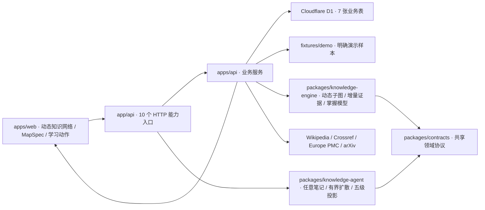
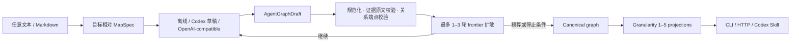

# Architecture

## Runtime flow

## Dependency rules

1. `packages/knowledge-engine` 不依赖 React、vinext 或 D1，可单独测试。
2. `apps/api` 负责输入校验、持久化和聚合；前端不得直接查询数据库。
3. `apps/web` 只消费 `KnowledgeAnalysis` 协议，不解释 SQL 表结构。
4. `fixtures/demo` 不得写入 D1，也不得标成用户笔记。
5. `app` 只保留页面和 HTTP 路由适配，不承载业务算法。
6. `packages/knowledge-agent` 将语义模型视为可替换提供器；规范化、证据校验、预算、停止条件和投影必须由确定性代码执行。

## Open-domain agent flow

模型只能提出候选概念和关系。Run API 会拒绝无法在对应输入笔记中逐字定位的“笔记证据”；无来源的模型候选必须显式使用空 evidence，并保持 `boundary / missing`。CLI 编译器还会隔离无效证据并修复循环或不可达的父子结构，避免图深度失控。

## Persistence

持久化由七张表组成：

| 表 | 责任 |
| --- | --- |
| `atlas_notes` | 原始笔记、来源、采集时间和 SHA-256 内容哈希 |
| `note_analysis_cache` | 每张笔记独立的概念证据贡献与分析器版本 |
| `knowledge_maps` | MapSpec、拓扑分析和冻结快照 |
| `discovery_cache` | 外部检索结果与 TTL |
| `concept_corrections` | 人工纠错提案和审核状态 |
| `mastery_evidence` | 保存、测验、复述和项目证据 |
| `knowledge_agent_runs` | 完整 Agent 输入、结果、状态、指标、时间与不可变父子 Run |

所有 SQL 使用 D1 prepared statements；常用查询具有实际索引，并在初始化后执行 `PRAGMA optimize`。

## Knowledge analysis

分析引擎执行七步：

1. 规范化概念名、别名和关键词。
2. 按 `noteId + contentHash + analyzerVersion` 复用未变化笔记的证据贡献。
3. 组合仓库级覆盖状态、深度、加权覆盖和结构完整度。
4. 从用户目标建议 MapSpec，再按粒度、跳数、节点上限裁剪子图。
5. 并行搜索 Wikipedia 与三类学术来源，执行 DOI/标题去重、查询相关性排序和启发式可信度评分。
6. 将掌握证据按类型权重和半衰期聚合，独立于“仓库覆盖”展示。
7. 学习或人工纠错后重算草稿；冻结地图通过派生版本保持可追溯性。

知识图谱的分母由 `ATLAS_SCOPE_VERSION` 固定版本，避免把动态探索结果伪装成唯一正确知识树。

## Security boundaries

- 外部抓取只接受 HTTPS，限制域名、重定向目标、内容类型、6 秒超时、300 KB 下载读取和 8,000 字符入库结果；
- 搜索供应商单点失败不会使整轮失败，每个供应商独立记录状态与延迟；
- 可信度是可解释的排序启发式，不是论文真伪认证；
- 冻结快照不在原地接受学习或目录变更，系统先创建下一版草稿。
